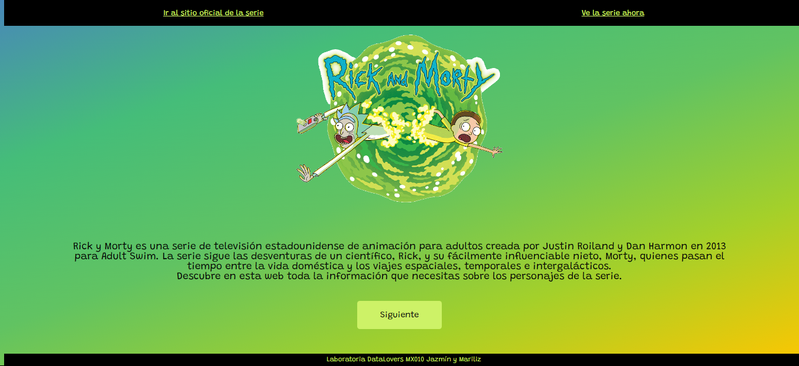
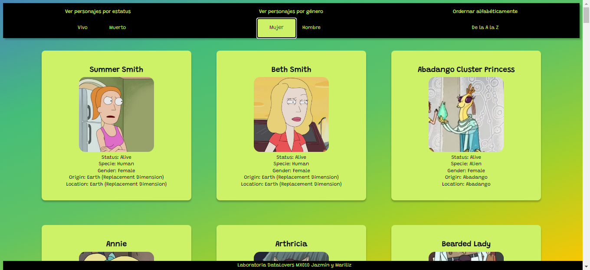
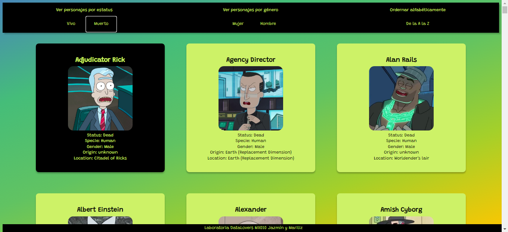

# Data Lovers

## Índice

* [1. Preámbulo](#1-preámbulo)
* [2. Resumen del proyecto](#2-resumen-del-proyecto)
* [3. Historias de usuario](#3-historias-de-usuario)
* [4. Proceso](#4-proceso)

***

## 1. Preámbulo  📖

[Rick and Morty](https://rickandmorty.com/) es una serie estadounidense creada en el 2013 por Justin Roiland y Dan Harmon.
Trata sobre las aventuras de Rick, un científico excentrico y Morty, su nieto. 

Decidimos emplear ese data set porque nos causó curiosidad de ver la serie, además de la versatilidad que ofrece la data de este tema. 

## 2. Resumen del proyecto 📋
Esta página web permitirá al usuario visualizar toda la información relacionada con los personajes de Rick and Morty. 
Además, te permite ver a los personajes filtrados por:

**Estatus**
- vivo 
- muerto

**Género**
- Hombre
- Mujer

Tambien podrás visualizar los personajes en orden alfabético de la A a la Z

## 3. Historias de usuario ⚙️

Las historias de usuario que abarca la página web son:
1. Como seguidora (o potencial seguidora) de Rick and Morty, quisiera ver un resumen general de la trama para, posteriormente, visualizar la data de personajes
2. Como seguidora (o potencial seguidora) de Rick and Morty, quisiera ver una interfaz que incluya toda la data, sin manipularla solo mostrar todos los personajes sin ningún filtro u orden.
3.Como seguidora (o potencial seguidora) de Rick and Morty quiero poder filtrar los personajes según su estatus (vivo o muerto).
4. Yo como seguidora (o potencial seguidora) de Rick and Morty quiero poder filtrar los personajes según su género (mujer u hombre)
5. Yo como seguidora de Rick&Morty quiero poder ordenar el nombre de los personajes en orden alfabético de la A-Z

## 4. Proceso 🛠️

#### Prototipos de baja fidelidad
Nuestros prototipos fueron testeados primeramente con un grupo de personas ajenas a Laboratoria y al proyecto, mediante una encuesta en donde se preguntaba si conocían la serie, si les parecía claro el flujo de la web, si pensaban que era complicado entender la funcionalidad de los botones y lo que hacía cada uno. De ese testeo, se arreglaron los detalles necesarios y después fue testeada con 2 duplas de Laboratoria que tambien se encontraban en el proyecto. 

#### Prototipos de alta fidelidad
Como resultado de la sesión de test y feedback con las duplas de Laboratoria, surgieron algunos cambios en cuanto al diseño de menú, que, por ser ya mínimos, se iteraron en la primera versión de nuesto prototipo de alta fidelidad diseñado en Figma. Puedes ver nuestro proceso de prototipado completo [aquí](https://www.figma.com/file/rmiMSJjHgkZPMUMm5oX3yW/Rick-and-Morty?node-id=0%3A1) 
Posteriormente, iteramos una última vez el diseño de nuestro menú para presentarlo en la última Demo del proyecto, cambiando su posición lateral a superior. Puedes ver el resultado final en Figma [aquí](https://www.figma.com/proto/rmiMSJjHgkZPMUMm5oX3yW/Rick-and-Morty?node-id=107%3A27&scaling=scale-down)  
  

### Resultados
Este proyecto estuvo lleno de aprendizaje. No fue un proceso fácil, pues durante un par de semanas nos encontramos con algunos bloqueos y garabatos rojos, sin embargo, nos sentimos satisfechas con el resultado final y el conocimiento obtenido. 

